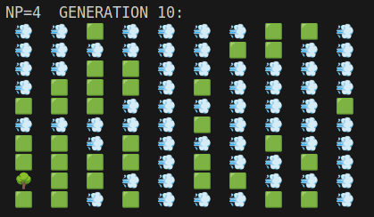
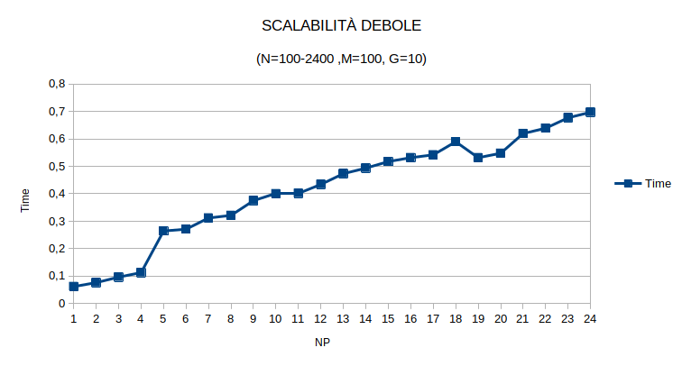

# MPI Implementation of Forest Fire

Corso di Programmazione Concorrente e Parellela su Cloud, Dipartimento di Informatica, Università degli studi di Salerno

Studente: Antonio Pappalardo, 0522500884


# Introduzione

Nella matematica applicata, un modello **Forest-Fire** è uno dei numerosi sistemi dinamici che mostrano criticità auto-organizzate. Si noti, tuttavia, che secondo Pruessner et al. (2002, 2004) il modello Forest-fire non si comporta in modo critico su scale molto grandi, cioè fisicamente rilevanti. Le prime versioni risalgono a Henley (1989) e Drossel e Schwabl (1992). Il modello è definito come un automa cellulare su una griglia con celle L^d. L è la lunghezza laterale della griglia e d è la sua dimensione. Una cella può essere vuota, occupata da un albero o in fiamme. Il modello di Drossel e Schwabl (1992) è definito da quattro regole che vengono eseguite simultaneamente:
 1. Una cella in fiamme si trasforma in una cella vuota
 2. Un albero andrà a fuoco, se almeno uno dei suoi vicini sta bruciando
 3. Un albero andrà a fuoco con probabilità f anche se i suoi vicini non stanno bruciando
 4. Una cella vuota si riempie con un albero con probabilità p

# Breve descrizione della soluzione proposta

 ### 1. Rappresentazione Matrice

Per rappresentare la foresta,che è una matrice, si è pensato di creare un array di array, successivamente scartato, per la complessità nella gestione.
L'approccio utilizzato, invece è un unico array di N x M elementi; dove N sono le righe e M le colonne.
Per la rappresentazione dello stato delle celle, si è provveduto ad utilizzare degli interi, dove:
 - 0 è una cella vuota;
 - 1 è una cella con albero;
 - 2 è una cella a fuoco;
 - 3 è una cella con fumo.

 ### 2. Suddivisione

L'approccio parallelo del problema, ha posto un quesito sulla suddivisione delle celle tra i vari processi.
Tra le varie soluzioni, sono state prese in cosiderazioni due tipi di soluzioni:
1. **Suddivisione per colonne**
    IMMAGINE
2. **Suddivisione per righe**
   IMMAGINE

La soluzione scelta è stata la seconda,ovvero divisione per righe, anche perchè C ha un orientamento di tipo row-major,cioè salva array multidimensionale affiaccando le varie righe.

 ### 3. Computazione

 Una volta suddivisa la matrice per ogni processo,inizia la computazione, e di coseguenza bisogna eseguire le regole di Drossel e Schwabl.
 Quindi: 
 1. se una cella va a fuoco, comunica ai vicini, e se la cella dei vicini ha una lbero, si trasformerà in in una cella che brucia;
 2. se una cella è vuota, viene generato un numero casuale, e se è inferiore a p, dove  1<=p<=100 ,allora la cella vuota diventa una cella con albero;
 3. se una cella contiene un albero, ciò implica che al momento non ha celle che bruciano vicino, viene generato un numero casuale, e se è inferiore a f, dove  1<=f<=100 ,allora la cella con albero diventa una cella che brucia.

 ### 4. Comunicazione

 La comunicazione tra i processi avviene quando:
 1. la cella appartiene alla prima riga del processo, quindi se il processo non è il master, comunica al processo inferiore, che contiene la riga superiore, la posizione della cella che brucia o -1;
 2. la cella appartiene all'ultima riga del processo, quindi se il processo non è l'ultimo , comunica al processo superiore, che contiene la riga inferiore, la posizione della cella che brucia o -1;
 3. tutti i processi, tranne l'ultimo, ricevono dal processo  che contiene la riga inferiore un intero j e se è diverso da -1, controllano la cella in posizione j all'ultima riga che hanno a disposizione; se tale cella contiene un albero, allora la cella diventa una cella che brucia.
 4. tutti i processi, tranne il master, ricevono dal processo  che contiene la riga superiore un intero j e se è diverso da -1, controllano la cella in posizione j alla prima riga che hanno a disposizione; se tale cella contiene un albero, allora la cella diventa una cella che brucia.    

# Dettagli Implementativi

In questa sezione verrano riportati vari pezzi di codice per quanto riguarda le sezioni fondamentali della soluzione proposta.
1. Creazione, suddivisione e scattering della foresta;
2. Computazione
3. Gathering della foresta

### 1. Creazione, suddivisione e scattering della foresta 

#### Creazione

Si è pensato di creare una struttura, che rende facile l'utilizzo della foresta.

```
typedef struct{
    int* matrix; 
    int rows;
    int columns;
}Forest;
```
Il processo Master, si occupa della creazione e dell'inizializzazione dela foresta mediante le funzioni:
```
Forest* createForest(int n,int m);
void initializeForestRandom(Forest* f);
```
Nello specifico:
- **createForest**
```
Forest* createForest(int n,int m){
    Forest* f=(Forest*)malloc(sizeof(Forest));
    f->matrix=(int*)malloc(sizeof(int)*n*m);
    f->columns=m;
    f->rows=n;
    return f;
}
```
- **initializeForestRandom**
```
void initializeForestRandom(Forest* f){
    srand(time(0));
    for (size_t i = 0; i < f->rows*f->columns; i++)
    {
        f->matrix[i]= rand()%3;
    }
}
```

#### Suddivisione

Come detto precedentemente, la suddivisione della matrice avviene per riga. 
Quindi si calcola quante righe ha ciascun processo. se ci sono righe in eccesso vengono poi distribuite tra i vari processi.
E si calcola la posizione di partenza dalla matrice iniziale, il numero di righe da inviare e il numero di righe ricevute per ogni processo
```
int execess_row=n%world_size;
int row_for_each_process=n/world_size;
for (size_t i = 0; i < world_size; i++)
{
    sendcount[i]=row_for_each_process;
    if (execess_row>0)
    {
        execess_row-=1;
        sendcount[i]+=1;
    }
    if (i==0)
    {
        starting[i]=0;
    }
    else{
        starting[i]=starting[i-1]+sendcount[i-1];
    }     
    if (rank==i && rank!=0)
    {
        recv_count=sendcount[i];
    }     
}
```

#### Scattering 

È stato creato un nuovo tipo MPI, che rappresentasse le righe.
```
    MPI_Datatype row;
    MPI_Type_contiguous( m , MPI_INT , &row);
    MPI_Type_commit( &row);
```

Per inviare la porzione di foresta ad ogni processo si è utilizzata un metodo della comunicazione collettiva, ovvero lo scattering. Nello specifico il metodo Scatterv.
```
    MPI_Scatterv( f->matrix, sendcount, starting, row, f->matrix, recv_count, row, 0, used_comm);
```

### 2.Computazione

La computazione viene eseguita da ogni processo e verifica se la cella va a fuoco. Se la cella va a fuoco, viene notificato ai vicini.
```
if (f->matrix[ap]==2)
{
    toreturn->matrix[ap]=3;
    if ( (j!=0) && (f->matrix[ap-1]==1) )
    {
        toreturn->matrix[ap-1]=2;
    }
    if ( (j!=f->columns-1) && (f->matrix[ap+1]==1) )
    {
        toreturn->matrix[ap+1]=2;
    }
    if ( (i!=0) && (f->matrix[ap-f->columns]==1) )
    {
        toreturn->matrix[ap-f->columns]=2;
    }
    if ( (i!=f->rows-1) && (f->matrix[ap+f->columns]==1) )
    {
        toreturn->matrix[ap+f->columns]=2;
    }
    if ( (rank!=0) && (i==0) )
    {
        isempty=1;
        MPI_Send(&j,1,MPI_INT,rank-1,10,used_comm);
    }
    if ( (rank!=world_size-1) && (i==f->rows-1) )
    {
        isempty=1;
        MPI_Send(&j,1,MPI_INT,rank+1,10,used_comm);
    }                      
}
```
Nel caso in cui la cella non va a fuoco, ma è una cella vuota, si controlla se c'è la possibilità che diventi una cella con albero
```
if (f->matrix[ap]==1 && (rand()%100<pf))
{
    f->matrix[ap]=2;
}
```
Nel caso in cui la cella non va a fuoco, ma è una cella con albero, si controlla se c'è la possibilità che diventi una cella che va a fuoco
```
if (f->matrix[ap]==0 && (rand()%100<pp))
{
    f->matrix[ap]=1;
}
```
Inoltre nel caso in cui sia una cella della prima riga e non è una cella del processo master, si occuperà di inviare al processo inferiore, che contiene la riga superiore -1, che indica che il vicino in basso non va a fuoco
```
if(i==0)
{
    if (rank!=0)
    {
        MPI_Send(&notburning,1,MPI_INT,rank-1,10,used_comm);
    }
}
```

Nel caso in cui sia una cella dell'ultima riga e non è una cella dell'ultimo processo, si occuperà di inviare al processo superiore, che contiene la riga inferiore -1, che indica che il vicino in alto non va a fuoco
```
if (i==f->rows-1)
{
    if (rank!=world_size-1)
    {
        MPI_Send(&notburning,1,MPI_INT,rank+1,10,used_comm);
    }
}
```

# Esecuzione

 La repository contiene 4 file:
 - ff.c : esecuzione semplice di Forest fire con misurazione delle prestazioni di scalabilità;
 - ff_graphic.c : esecuzione semplice di forest fire con stampa foresta iniziale e finale; 
 - ff_correctness.c : esecuzione di forest fire con stampa ad ogni generazione;
 - ff_misuring.c : esecuzione di forest fire con salvataggio della misurazione su file in input;
## Test in Locale
**ff.c**
```
mpicc -o ff ff.c
mpirun -np <X> ./ff <N> <M> <G>
```
**ff_graphic.c**
```
mpicc -o ff_graphic ff_graphic.c
mpirun -np <X> ./ff_graphic <N> <M> <G>
```
**ff_correctness.c**
```
mpicc -o ff_correctness ff_correctness.c
mpirun -np <X> ./ff_correctness <N> <M> <G>
```
**ff_misuring.c**
```
mpicc -o ff_misuring ff_misuring.c
mpirun -np <X> ./ff_misuring <N> <M> <G> <F>
```

>Dove:
> - **X** numero di processori
> - **N** numero di righe
> - **M** numero di colonne
> - **G** numero di generazioni
> - **F** File dove inserire i risultati


## Test su cluster


**ff.c**
```
mpicc -o ff ff.c
mpirun -np <X> --hostfile <H> ./ff <N> <M> <G>
```
**ff_graphic.c**
```
mpicc -o ff_graphic ff_graphic.c
mpirun -np <X> --hostfile <H> ./ff_graphic <N> <M> <G>
```
**ff_correctness.c**
```
mpicc -o ff_correctness ff_correctness.c
mpirun -np <X> --hostfile <H> ./ff_correctness <N> <M> <G>
```
**ff_misuring.c**
```
mpicc -o ff_misuring ff_misuring.c
mpirun -np <X> --hostfile <H> ./ff_misuring <N> <M> <G> <F>
```

>Dove:
> - **X** numero di processori
> - **N** numero di righe
> - **M** numero di colonne
> - **G** numero di generazioni
> - **F** File dove inserire i risultati
> - **H** File degli hostfile

# Correttezza

Per verificare la correttezza dell'algoritmo è stato utilizzata la versione **ff_correctness.c**, che visualizza il risultato di ogni generazione. Allo scopo di valutare la correttezza è stato deciso di verificare se al variare del numero di processori, l'algoritmo portasse lo stesso risultato considerando lo stessa matrice di input. In particolare per ottenere lo stesso input, la generazione della matrice viene effettuata attraverso una generazione casuale con lo stesso seme (in particolare il seme è 0):

```
void initializeForestRandom(Forest* f){
    srand(0);
    for (size_t i = 0; i < f->rows*f->columns; i++)
    {
        f->matrix[i]= rand()%3;
    }
}
```

Inoltre anche la la generazione delle probabilità  ***p*** e ***f*** avrà lo stesso seme:
```
srand(0);
if (f->matrix[ap]==1 && (rand()%100<pf))
{
    f->matrix[ap]=2;
}
if (f->matrix[ap]==0 && (rand()%100<pp))
{
    f->matrix[ap]=1;
}
```
**Testing**
```
mpirun -np <X> ./ff_correctness 10 10 10
```
>Dove:
> - **X** numero di processori {1,2,3,4}
L'esecuzione ha prodotto i seguenti risultati:

 - NP=1

    

 - NP=2

    

 - NP=3

    

 - NP=4 

    


# Benchmark
Per la misurazione è stato utilizzato un cluster creato mediante GCP.
Sono state instanziate 6 macchine e2-standard-4 nella zona del South-Carolina, ogni macchina ha tali caratteristiche:
4VCPUs, 16GB di memoria Ram, Sistema operativo Ubuntu.

- **Scalabilità Debole**:Esecuzione dell'algoritmo con un rapporto processo/quantità di dati prefissato

|Dimensione| Numero Processi | N | M | G |
|--- | --- | --- | --- | --- |
|Piccolo| da 1 a 24 | da 100 a 2400 | 200 | 100 |
|Medio| da 1 a 24 | da 1000 a 24000 | 1000 | 100 |
|Grande| da 1 a 24 | da 2000 a 48000 | 1000 | 100 |

- **Scalabilità Forte**:Esecuzione dell'algoritmo con una dimensione prefissata della matrice.

|Dimensione| Numero Processi | N | M | G |
|--- | --- | --- | --- | --- |
|Piccolo| da 1 a 24 | 200 | 200 | 100 |
|Medio| da 1 a 24 | 2000 | 2000 | 100 |
|Grande| da 1 a 24 | 5000 | 5000 | 100 |

## Risultati

### Scalabilità Debole

**Test Piccolo**




**Test Medio**


**Test Grande**


Per quanto riguarda i risultati di scalabilità debole, è possibile vedere come mantenendo costante il numero di dati da computare per ogni processo, il tempo di esecuzione aumenta. Notando particolari effetti nell'esecuzione piccola, è possibile che l'aumento del tempo di esecuzione sia dovuto alla comunicazione tra i processi per lo scambio delle righe. Infine è possibile notare che questo è effetto è visibile solo per una bassa quantità di dati da computare, e quindi non crea effetti considerevoli e che aumentano proporzionalmente alla dimensione dei dati di computazione, ma in quantità di dati maggiori l'algoritmo riesce a non avere variazioni considerevoli di esecuzione di tempo all'aumento dei dati e quindi si può considerare che i dati possono essere equalmente distribuiti tra i diversi processi.

### Scalabilità Forte

**Test Piccolo**


**Test Medio**


**Test Grande**


mediante i grafici è possibile vedere l'effetto importante che dà l'algoritmo parallelo rispetto al sequenziale in tempi di esecuzioni. Importante notare come da un numero di processi maggiore di 7 si è ritrovato un aumento del tempo di esecuzione, possibilmente dovuto al tempo di comunicazione tra i diversi processi. 